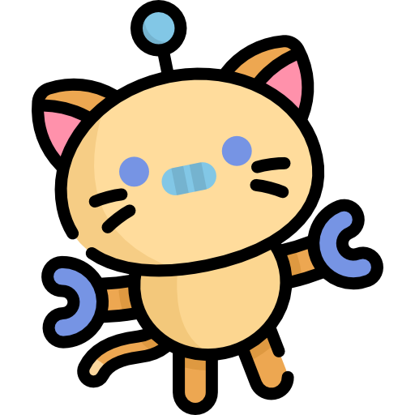

# Petminion




## Project principles

* A generalized tool for (semi?) automated training of animals
* Use 'off-the-shelf' hardware as much as possible (hopefully no soldering, no requirement for 3D printing)
* Make the software accessible and extendable by beginning coders.  Particularly for adding training rules.
* Two initial test cases: cat training and crow training
* Project should be fun and useful for both the developers and the users

## Required hardware

FIXME

## Installing

This project is probably not yet ready for others, so you should probably not install for now... 

But!

This framework is written in python and intended to be run on something like a raspberry pi.  However, if you are just interested in trying it out it can even be run on a desktop (where the feeder hardware and/or camera is simulated).

To install, run the following command on any machine which has a recent python version installed.  

```
pipx install petminion
```

This tool is mostly written for linux, but if you find problems on other platforms please open a github issue and we'll try to figure out what's wrong.

## Running

Run 'petminion' from your command line and it should hopefully do something.
(FIXME add more details)

## Development Schedule

I'll be writing the first version in Winter of 2023 (in this github) and then iterating with my cat and black winged test subjects through the winter and spring.
If you'd like to contact me, I'm kevinh@geeksville.com.

## Training rules

The trainer works by using short 'training rules' to provide tasks/rewards to the animals.  Initially we have a few sample rules, but hopefully over time people will write (and distribute) other rules.  So that collaboratively we can build a set of rules for different animals, tasks and settings.

To drive initial development @geeksville is using two use-case rules.  One for his cat and other for the birds on his deck.

### Sample cat training

level 0 attempt CatTrainingRule0:

- look for targets (springs) on white board.  
- count number of springs seen.
- if number of springs increases & cat present -> emit food (if # feed events per day not reached - or implicitly limited by # of springs in house)

level 1 attempt CatTrainingRule1:

- after spring seen and feed event -> power GPIO to somehow empty the target area

### Sample crow training

level 0 attempt (keep food always present CrowTrainingRule0):

- look at target and if no food present -> emit food

level 1 attempt (only emit food once we see a bird - to get birds used to feeder noise):

- look at target no food and no bird -> emit food 

level 2 attempt (only feed crows):

- look at target no food and no crow -> emit food 

level 3 attempt (provide tokens on a shelf just above target - hopefully crow knocks tokens into target)

- look at target no food, no crow and no token -> emit food

level 4 attempt (provide tokens nearby but not on shelf)

- same as above except tokens are not close, also we will count anything as a 'token' doesn't have to be the tokens we provided

FIXME - add GPIO control to empty unused food and empty tokens.

# Copyright, license and credits

Copyright 2023 S. Kevin Hester kevinh@geeksville.com

License: GNU Public License v3 (see [LICENSE](LICENSE) for details)

Robot icons created by [Freepik - Flaticon](https://www.flaticon.com/free-icons/robot).